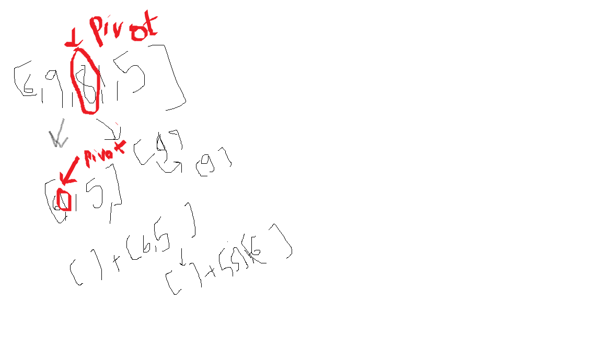

Hello Peeps! 
Just fucked up my silly question (recursive MergeSort!!!!) at DSA LAB FAT EXAM hope you  
dont do it ... 
#Reasons: 
1)Despite knowing i could use try catch ... i didnt use it ....  
2)Got carried away by that BiGGG "C" program question and lost the opportunity to score both!!!!  
3)As ive nailed it now(! phew :( ) ) just remember your recursions well peeps and dont commit the mistakes i do   
Look at the scoring question not the challenging one (specially not in FAT LABS !!!!!)  
 
